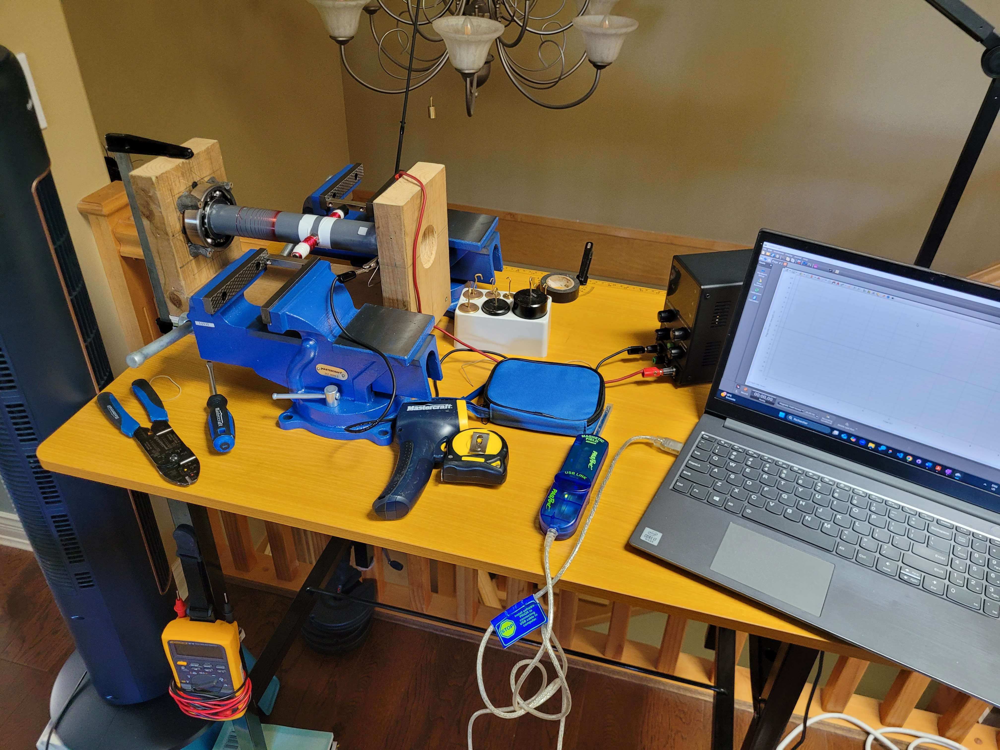

# DC-Motor-Performance-Analysis

### Investigating the Effect of Magnetic Field Strength on Mechanical Power Output

Independent research project conducted as an IB Physics Extended Essay.

## Overview

This project investigates how varying the magnetic field strength of a
custom-built brushed DC motor affects its mechanical power output.

The motor was experimentally tested across magnetic field strengths from
0.030 T to 0.100 T while maintaining a 40 W electrical power input.
Experimental results were compared with MATLAB/Simulink theoretical models
incorporating thermal losses and magnetic saturation.

## Key Results

- Magnetic field strength tested: 0.030–0.100 T
- Electrical input power: 40 W
- Maximum measured rotational speed: 411 +- 8 RPM
- Maximum measured mechanical power of Experimental Motor: 0.169 ± 0.008 W
- Mechanical power increased by approximately 156% across the tested range
- Experimental curve fit correlation: 0.9985
- Magnetic saturation was identified as a major factor limiting power gains
  at higher field strengths

## Experimental Setup

### Apparatus and Tools

###

The motor was constructed using:
- 26-gauge enameled copper wire
- 300 turns per armature side
- Ball bearings held in place by epoxy putty and screws
- Copper-strip commutator
- Neodymium magnets
- 0.0200 kg suspended load

Magnetic field strength was measured using a PASCO 2-axis magnetic field sensor (PS-3221),
while rotational speed was measured using a non-contact tachometer.

## Experimental Results

| Magnetic Field | Average RPM | Mechanical Power |
|---|---:|---:|
| 0.030 T | 160 RPM | 0.066 W |
| 0.040 T | 224 RPM | 0.092 W |
| 0.050 T | 290 RPM | 0.119 W |
| 0.060 T | 333 RPM | 0.137 W |
| 0.070 T | 357 RPM | 0.147 W |
| 0.080 T | 384 RPM | 0.157 W |
| 0.090 T | 401 RPM | 0.165 W |
| 0.100 T | 411 RPM | 0.169 W |

## Modeling

MATLAB/Simulink was used to develop theoretical models of the DC motor.

Three configurations were investigated:

1. Base theoretical model
2. Thermal-loss model
3. Magnetic-saturation model

The models incorporated electrical and mechanical motor dynamics,
including armature resistance, inductance, torque, back EMF, friction,
and rotational dynamics.

## Engineering Analysis

Experimental power output increased with magnetic field strength but began
to plateau at higher field strengths.

The theoretical models predicted greater power output than the physical
motor. This discrepancy was attributed to losses present in the physical
system, including resistive, commutator, brush, and iron losses.

The saturation model more closely reproduced the shape of the experimental
data than the base and thermal models.

## Full Paper

[Read the full IB Physics Extended Essay](paper/IB_Physics_Extended_Essay.pdf)

## Tools & Technologies

- MATLAB / Simulink
- DC motor modeling
- Experimental data analysis
- Electromagnetic theory
- Electrical and mechanical systems
- Tachometry
- Magnetic field measurement
- Uncertainty analysis